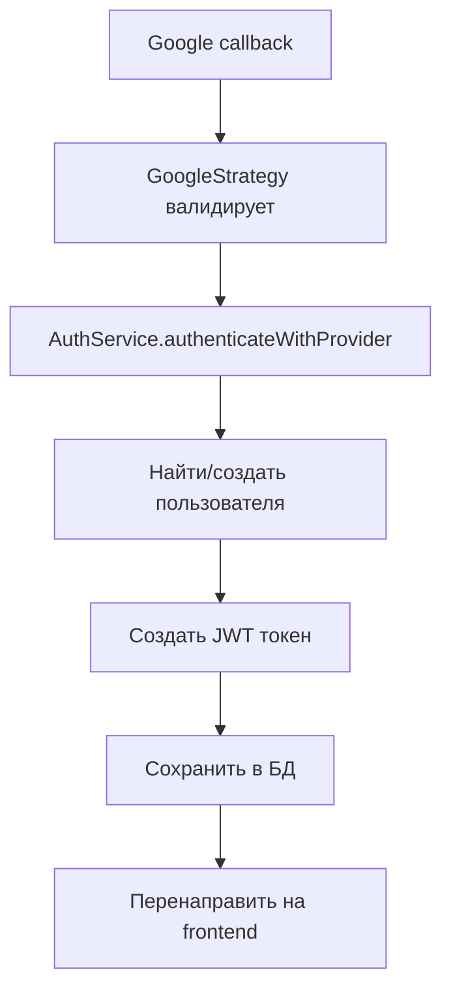
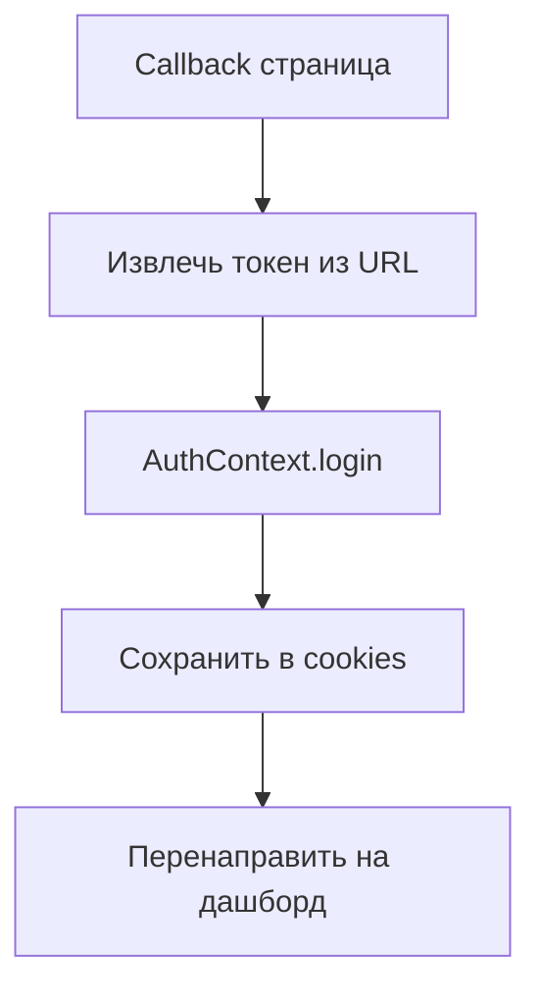

# 🔐 Универсальная система аутентификации NeSXt

Полнофункциональная система аутентификации с поддержкой множественных провайдеров, управлением токенами в базе данных и продвинутыми возможностями безопасности.

## 🎯 Основные возможности

### ✨ Универсальность
- 🌐 Поддержка множественных OAuth провайдеров (Google, GitHub, Discord, Facebook, Twitter, Apple)
- 🔗 Связывание нескольких провайдеров с одним аккаунтом
- 🎛️ Легкое добавление новых провайдеров

### 🔐 Безопасность
- 💾 Хранение токенов в базе данных вместо только JWT
- 🕐 Управление временем жизни токенов
- 🚫 Мгновенный отзыв токенов
- 🧹 Автоматическая очистка просроченных токенов
- 📱 Отслеживание устройств и сессий

### 🏗️ Архитектура
- 🎨 Современная модульная архитектура
- 🔄 Middleware для автоматической валидации
- 🎯 Декораторы для удобной работы с аутентификацией
- 📊 Подробное логирование событий

## 🗄️ Структура базы данных

### Таблица `users`
```sql
- id: string (CUID)
- email: string (unique)
- name: string
- avatar: string?
- isActive: boolean
- createdAt: DateTime
- updatedAt: DateTime
```

### Таблица `auth_providers`
```sql
- id: string (CUID)
- name: string (unique) -- google, github, discord, etc.
- displayName: string -- "Google", "GitHub", "Discord"
- isActive: boolean
- config: string? -- JSON конфигурация
- createdAt: DateTime
- updatedAt: DateTime
```

### Таблица `user_providers`
```sql
- id: string (CUID)
- userId: string (FK -> users.id)
- providerId: string (FK -> auth_providers.id)
- providerUserId: string -- ID в системе провайдера
- providerData: string? -- JSON данные от провайдера
- isActive: boolean
- lastUsed: DateTime
- createdAt: DateTime
- updatedAt: DateTime

UNIQUE(providerId, providerUserId)
```

### Таблица `user_tokens`
```sql
- id: string (CUID)
- userId: string (FK -> users.id)
- token: string (unique) -- JWT токен
- type: string -- ACCESS, REFRESH, RESET, VERIFY
- isActive: boolean
- expiresAt: DateTime
- createdAt: DateTime
- updatedAt: DateTime
- userAgent: string?
- ipAddress: string?
- deviceInfo: string? -- JSON информация об устройстве
```

### Таблица `user_sessions` (опционально)
```sql
- id: string (CUID)
- userId: string (FK -> users.id)
- sessionId: string (unique)
- isActive: boolean
- expiresAt: DateTime
- createdAt: DateTime
- updatedAt: DateTime
- lastAccessAt: DateTime
- userAgent: string?
- ipAddress: string?
- deviceInfo: string?
```

## 🚀 API Endpoints

### 📡 TRPC Endpoints

#### Публичные методы
```typescript
// Получить URL для аутентификации через Google
auth.getGoogleAuthUrl() -> { authUrl: string, provider: string }

// Получить список доступных провайдеров
auth.getAvailableProviders() -> { 
  providers: Array<{
    name: string,
    displayName: string,
    authUrl: string,
    isActive: boolean
  }>
}

// Проверить статус аутентификации (опционально)
auth.getAuthStatus() -> { 
  isAuthenticated: boolean, 
  user?: User 
}
```

#### Аутентифицированные методы
```typescript
// Получить текущего пользователя
auth.getCurrentUser() -> User

// Получить профиль пользователя с провайдерами
auth.getUserProfile(input?: { userId?: string }) -> UserWithProviders

// Получить токены пользователя
auth.getUserTokens(input?: { activeOnly?: boolean }) -> { 
  tokens: Array<TokenInfo>
}

// Выйти из системы
auth.signOut(input?: { token?: string }) -> { 
  success: boolean, 
  message: string 
}

// Отозвать токен
auth.revokeToken(input: { token: string }) -> { 
  success: boolean, 
  message: string 
}

// Отозвать все токены пользователя
auth.revokeAllTokens() -> { 
  success: boolean, 
  message: string, 
  revokedCount: number 
}

// Очистить просроченные токены (админ)
auth.cleanupExpiredTokens() -> { 
  success: boolean, 
  message: string, 
  cleanedCount: number 
}
```

### 🌐 REST Endpoints

```typescript
// OAuth flow endpoints
GET  /auth/google              // Инициировать Google OAuth
GET  /auth/google/callback     // Callback для Google OAuth
GET  /auth/github              // GitHub OAuth (пока не реализован)
GET  /auth/discord             // Discord OAuth (пока не реализован)
GET  /auth/facebook            // Facebook OAuth (пока не реализован)

// Utility endpoints
GET  /auth/status              // Проверить статус аутентификации
GET  /auth/logout              // Выйти через REST API
```

## 🏗️ Компоненты системы

### 🎯 AuthService
Основной сервис с методами:
- `authenticateWithProvider()` - Универсальная аутентификация
- `validateToken()` - Валидация токенов
- `createToken()` - Создание новых токенов
- `revokeToken()` - Отзыв токенов
- `findOrCreateUser()` - Управление пользователями
- `logAuthEvent()` - Логирование событий

### 🛡️ AuthMiddleware
Автоматическая валидация токенов для всех запросов:
- Извлечение токенов из заголовков или cookies
- Валидация и добавление в контекст запроса
- Обновление времени последнего использования

### 🎨 Декораторы
- `@AuthUser()` - Получить аутентифицированного пользователя
- `@OptionalAuthUser()` - Получить пользователя если аутентифицирован
- `@AuthToken()` - Получить токен аутентификации
- `@AuthContext()` - Получить полный контекст аутентификации

### 🛡️ Guards
- `AuthGuard` - Требует аутентификации
- `OptionalAuthGuard` - Опциональная аутентификация

## 🎛️ Конфигурация

### Переменные окружения
```bash
# Database
DATABASE_URL="file:./dev.db"

# JWT Secret
JWT_SECRET="your-super-secret-jwt-key-change-this-in-production"

# Google OAuth
GOOGLE_CLIENT_ID="your-google-client-id"
GOOGLE_CLIENT_SECRET="your-google-client-secret"

# Application URLs
FRONTEND_URL="http://localhost:3000"
BACKEND_URL="http://localhost:4000"

# Session Secret
SESSION_SECRET="your-super-secret-session-key-change-this-in-production"
```

### JWT конфигурация
```typescript
JwtModule.registerAsync({
  useFactory: async (configService: ConfigService) => ({
    secret: configService.get<string>('JWT_SECRET'),
    signOptions: {
      expiresIn: '7d',
      issuer: 'nesxt-auth',
      audience: 'nesxt-users',
    },
  }),
})
```

## 🎨 Frontend интеграция

### AuthContext
```typescript
const { 
  user,                    // Данные пользователя
  token,                   // JWT токен
  isAuthenticated,         // Статус аутентификации
  isLoading,              // Состояние загрузки
  login,                  // Функция входа
  logout,                 // Функция выхода
  refreshUserData,        // Обновление данных
  availableProviders      // Доступные провайдеры
} = useAuth();
```

### Использование
```tsx
// Проверка аутентификации
if (isAuthenticated) {
  return <Dashboard user={user} />;
}

// Вход через провайдера
const handleLogin = (provider: AuthProvider) => {
  window.location.href = provider.authUrl;
};

// Выход
const handleLogout = async () => {
  await logout();
};
```

## 🔄 Поток аутентификации

### 1. Инициация OAuth
```mermaid
graph TD
    A[Пользователь нажимает "Войти"] --> B[Перенаправление на /auth/google]
    B --> C[Google OAuth экран]
    C --> D[Пользователь подтверждает]
    D --> E[Перенаправление на /auth/google/callback]
```

### 2. Обработка callback


### 3. Frontend обработка


## 🛡️ Безопасность

### 🔐 Токены
- Хранятся в базе данных с метаданными
- Можно отозвать мгновенно
- Автоматически истекают
- Привязаны к устройству/IP

### 🕐 Сессии
- Отслеживание активности
- Автоматический logout неактивных сессий
- Контроль множественных устройств

### 📊 Логирование
- Все события аутентификации логируются
- Отслеживание подозрительной активности
- Аудит доступа к системе

## 🚀 Добавление новых провайдеров

### 1. Создать стратегию
```typescript
// github.strategy.ts
@Injectable()
export class GitHubStrategy extends PassportStrategy(Strategy, 'github') {
  constructor() {
    super({
      clientID: process.env.GITHUB_CLIENT_ID,
      clientSecret: process.env.GITHUB_CLIENT_SECRET,
      callbackURL: '/auth/github/callback',
      scope: ['user:email'],
    });
  }

  async validate(accessToken: string, refreshToken: string, profile: any) {
    const githubProfile: GitHubProfile = {
      id: profile.id,
      email: profile.emails[0].value,
      name: profile.displayName || profile.username,
      avatar: profile.photos[0]?.value,
      provider: AuthProviderType.GITHUB,
      githubId: profile.id,
      username: profile.username,
      raw: profile,
    };

    return this.authService.validateGitHubUser(githubProfile);
  }
}
```

### 2. Добавить REST endpoints
```typescript
@Get('github')
@UseGuards(AuthGuard('github'))
async githubAuth() {}

@Get('github/callback')
@UseGuards(AuthGuard('github'))
async githubCallback(@Req() req: Request, @Res() res: Response) {
  // Аналогично Google callback
}
```

### 3. Обновить конфигурацию
```typescript
// В auth.module.ts
providers: [
  // ...
  GitHubStrategy,
],
```

## 🎯 Примеры использования

### Проверка токена в middleware
```typescript
const authMiddleware = async (req: Request, res: Response, next: NextFunction) => {
  const token = req.headers.authorization?.replace('Bearer ', '');
  
  if (token) {
    const validation = await authService.validateToken(token);
    if (validation.isValid) {
      req.auth = {
        user: validation.user,
        token: validation.token,
      };
    }
  }
  
  next();
};
```

### Защищенный TRPC endpoint
```typescript
@Query()
@Output(UserSchema)
async getProfile(@AuthUser() user: User) {
  return await this.userService.getProfile(user.id);
}
```

### Отзыв всех токенов при компрометации
```typescript
const revokeAllUserTokens = async (userId: string) => {
  await authService.revokeAllUserTokens(userId);
  // Пользователь будет выкинут из всех устройств
};
```

## 📈 Мониторинг и аналитика

### События для логирования
- `LOGIN_SUCCESS` - Успешный вход
- `LOGIN_FAILED` - Неудачная попытка входа
- `LOGOUT` - Выход из системы
- `TOKEN_CREATED` - Создание токена
- `TOKEN_EXPIRED` - Истечение токена
- `TOKEN_REVOKED` - Отзыв токена
- `PROVIDER_LINKED` - Связывание провайдера
- `PROVIDER_UNLINKED` - Отвязывание провайдера

### Метрики
- Количество активных пользователей
- Популярность провайдеров
- Среднее время сессии
- Географическое распределение

## 🔧 Обслуживание

### Очистка просроченных токенов
```bash
# Можно настроить как cron job
curl -X POST "http://localhost:4000/api/trpc/auth.cleanupExpiredTokens" \
  -H "Authorization: Bearer YOUR_ADMIN_TOKEN"
```

### Массовый отзыв токенов
```typescript
// При обнаружении компрометации
await authService.revokeAllUserTokens(compromisedUserId);
```

### Резервное копирование
```bash
# Регулярное резервное копирование БД
cp dev.db backup/dev_$(date +%Y%m%d_%H%M%S).db
```

## 🎉 Заключение

Универсальная система аутентификации NeSXt предоставляет:

✅ **Безопасность** - Токены в БД, мгновенный отзыв, детальное логирование
✅ **Масштабируемость** - Легкое добавление новых провайдеров
✅ **Удобство** - Простые декораторы и middleware
✅ **Гибкость** - Поддержка множественных провайдеров на одном аккаунте
✅ **Мониторинг** - Подробная аналитика и отслеживание

Система готова к продакшн использованию и может быть легко расширена под любые требования! 